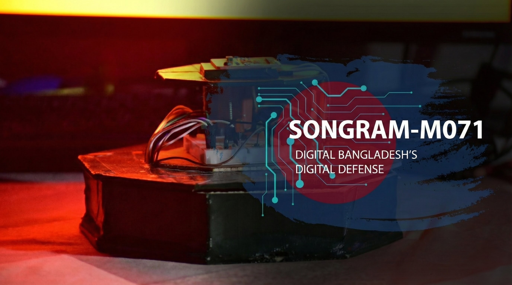
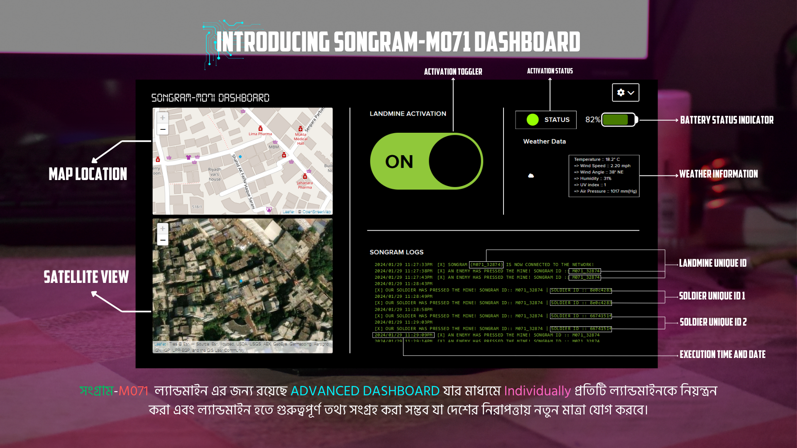
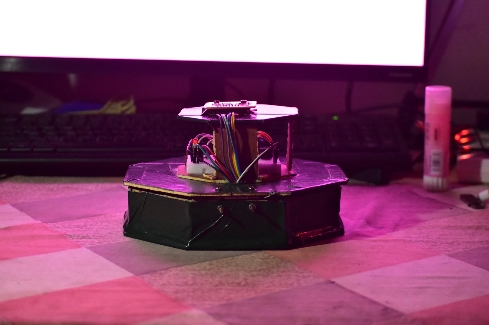

# 🛡️ Songram-M071
### Tactical Defense System | Smart Landmine Prototype with C2 Dashboard

**Songram-M071** is a prototype **Smart Area Denial System** designed to modernize tactical defense operations. Unlike traditional static countermeasures, Songram-M071 utilizes a **Master-Slave architecture** (ESP32 + Arduino) to provide remote arming/disarming, real-time GPS tracking, and "Friend-or-Foe" (IFF) identification via a centralized Command & Control (C2) dashboard.

---

## 📸 System Gallery

| **Command & Control (C2) Dashboard** | **Hardware Unit (Active)** |
| :---: | :---: |
|  |  |
| *Real-time geospatial tracking & logs* | *ESP32 + Arduino Dual-Core Architecture* |

---

## ⚠️ Problem Statement vs. Engineering Solution

Traditional landmines are hazardous static assets that pose long-term risks to friendly forces and civilians. Songram-M071 mitigates these risks through active state management.

| Traditional Landmine Issues | Songram-M071 Engineering Solutions |
| :--- | :--- |
| ❌ **Friendly Fire Risk** | ✅ **NFC/RFID Identification:** The system detects "Friendly" ID tags and automatically suppresses the trigger mechanism, logging the event as "Safe Passage" instead of detonation. |
| ❌ **Irreversible Activation** | ✅ **Remote State Management:** Can be remotely toggled between **Active (Armed)** and **Inactive (Safe)** modes via the Dashboard using low-latency MQTT packets. |
| ❌ **Zero Visibility** | ✅ **Live Telemetry:** Streams real-time GPS location, battery voltage, and operational status to the Command Center to prevent lost ordinance. |
| ❌ **"Dumb" Hardware** | ✅ **Environmental Sensing:** Onboard sensors relay local weather data (Wind Speed/Temp) to HQ to aid in broader tactical planning. |

---

## 🏗️ System Architecture

This project demonstrates a high-reliability **"Edge-to-Cloud"** implementation optimized for sub-50ms latency:

1.  **The "Sentry" (ESP32):** Handles Wi-Fi/GSM connection, parses MQTT payloads, and reports battery voltage/status. It acts as the primary gateway.
2.  **The "Trigger" (Arduino):** Dedicated to handling sensor interrupts (pressure/vibration) with microsecond precision, ensuring no trigger event is missed.
3.  **The "HQ" (React Dashboard):** A secure admin panel for monitoring the fleet, featuring OpenStreetMap integration for geospatial visualization.

---

## 🛠️ Tech Stack

* **Hardware:**
    * **ESP32:** MQTT Client & Wi-Fi Gateway.
    * **Arduino:** L298N Motor Driver Interface & Sensor Logic.
    * **Sensors:** GPS Module, Environmental Sensors, NFC Reader.
* **Communication Protocol:** **MQTT** (Message Queuing Telemetry Transport) for secure, low-bandwidth communication in unstable network environments.
* **Frontend Interface:** React.js, Leaflet Maps API, CSS Modules (High-Contrast Tactical UI).
* **Backend:** Node.js (MQTT Broker management).

---

## 🚀 Key Features

* **📍 Geospatial Intelligence:** Visualizes the exact deployment location of every unit on a satellite map.
* **⚔️ Remote Activation (Arming):** Features a "Landmine Activation" toggle that physically arms/disarms the unit remotely.
* **🆔 IFF Logic (Identification Friend or Foe):** As seen in the console logs, the system distinguishes between "Soldier" (Friendly) and "Enemy" triggers based on RFID signatures.
* **🔋 Power Efficiency:** Implements deep-sleep cycles on the ESP32 to extend field operational time.

---

## 🔌 Pinout & Wiring

* **ESP32 ↔ Arduino:** UART Serial Communication (RX/TX).
* **Motor/Trigger Mechanism:** Connected to Arduino Digital Pins (PWM).
* **Power Distribution:** Shared Ground (GND) is critical between the logic layer (ESP32) and the mechanical layer (Arduino/Drivers).

---

### 👨‍💻 Author

**Sowmik**
*Systems-Aware Data Scientist & Defense Tech Enthusiast*
[GitHub Profile](https://github.com/sowmiksudo)
